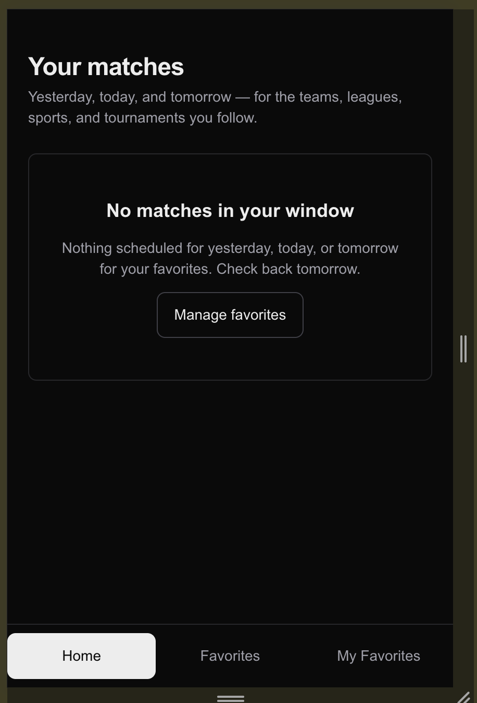

# Task 06 Proofs — Live auto-refresh + Page Visibility gating

## Task Summary

This task proves that the score-tracker homepage now refreshes live scores automatically while a match is in progress, without forcing a page reload, and without burning network or battery when the user isn't looking at the tab. The implementation lives entirely in `components/home-client.tsx` and is fully covered by automated tests using `vi.useFakeTimers()`.

The remaining sub-tasks of 6.0 (local manual end-to-end, push, Vercel deploy verification, real-device mobile screenshot, prod DB count) are explicitly user-driven and out of scope for this automated pass — they're called out as deferred in the task file.

## What This Task Proves

- `HomeClient` polls `/api/home` every 60 s **only while** the current response contains ≥1 match with `status === "live"`.
- Polling **stops** automatically when the envelope transitions to all-Final/Upcoming (the polling effect's cleanup clears the interval).
- Polling **pauses** when the tab becomes hidden and **resumes** with an immediate refetch when it returns to visible.
- In-flight fetches are **aborted** on unmount, on visibility-hidden, and on any subsequent fetch.
- No new env vars were introduced — `README.md` requires no update.

## Evidence Summary

- `pnpm typecheck` — clean.
- `pnpm lint` — clean (zero errors, zero warnings).
- `pnpm format:check` — clean.
- `pnpm test:ci` — **162/162 tests** across 24 files (up from 158; +4 new polling assertions).

## Artifact: Live-gated polling + visibility pause/resume in `components/home-client.tsx`

**What it proves:** The polling effect only schedules an interval when the current envelope contains at least one live match, and the interval short-circuits if the tab is hidden.

**Why it matters:** This is the entire user-facing benefit of Task 6.0 — live scores update without a reload, and the tab quietly stops polling when scores aren't live or when the user looks away. It's also the implementation guarantee behind the cost/battery non-functional concern.

**Artifact path:** `components/home-client.tsx`

**Result summary:** A dedicated effect with `[state]` deps owns the `setInterval`; its cleanup `clearInterval`s on every state change, so the "matches went from live → final" case stops polling without explicit code. A separate mount-only effect owns the visibilitychange listener (aborts inflight on hidden, refetches on visible). Both effects share an `abortRef` so an in-flight fetch is always cancelled before a new one starts and on unmount.

Relevant excerpt:

```tsx
// Polling: while we have a `ready` response containing at least one live
// match, refetch every POLL_MS. The interval is rebuilt whenever `state`
// changes; clearing on cleanup handles the "no live → stop polling" case.
useEffect(() => {
  if (state.status !== "ready") return;
  if (!envelopeHasLive(state.envelope)) return;
  const id = setInterval(() => {
    if (
      typeof document !== "undefined" &&
      document.visibilityState !== "visible"
    ) {
      return;
    }
    fetchTriggerRef.current?.();
  }, POLL_MS);
  return () => clearInterval(id);
}, [state]);
```

## Artifact: `components/home-client.test.tsx` — 4 new polling assertions

**What it proves:** Each of the four proof conditions in the task spec is asserted by an automated test.

**Why it matters:** Locks the contract: polling fires on the right cadence only when it should, pauses on hidden, resumes on visible, and never leaks an in-flight fetch across unmount. The tests run on every PR via `.github/workflows/ci.yml`.

**Command:**

```bash
pnpm test:ci components/home-client.test.tsx
```

**Result summary:** 8/8 pass (4 static cases from Task 5.0 + 4 new polling cases). Uses `vi.useFakeTimers()` plus `vi.advanceTimersByTimeAsync` inside `act()` wrappers to avoid React-19 act warnings. Visibility transitions driven by overriding `document.visibilityState` and dispatching `new Event("visibilitychange")`.

The four polling cases:

| # | Behavior asserted | How it's driven |
| --- | --- | --- |
| a | Polls every 60 s while ≥1 live match is present | Mock envelope has a `status: "live"` match; advance fake timers 2× 60 s; expect 3 total `fetch` calls |
| b | Does not poll when only Final/Upcoming matches are present | Mock envelope has only `status: "final"`; advance 180 s; expect still 1 `fetch` call |
| c | Pauses on hidden, refetches + resumes on visible | Override `document.visibilityState`; dispatch `visibilitychange`; assert no polling for 120 s when hidden; assert immediate refetch + 60 s cadence after visible |
| d | Aborts in-flight fetch on unmount | Mock `fetch` to return a never-resolving Promise that captures its `AbortSignal`; unmount; assert `signal.aborted === true` |

## Artifact: Quality gates (typecheck, lint, format, full test suite)

**What it proves:** The change set passes every CI gate locally.

**Why it matters:** The CI workflow at `.github/workflows/ci.yml` runs install + lint + format:check + typecheck + test:ci + build on every PR and push. Passing locally protects the upstream branch.

**Commands and result summary:**

```bash
pnpm typecheck   # clean (tsc --noEmit, no output)
pnpm lint        # clean (eslint, zero errors, zero warnings)
pnpm format:check # "All matched files use Prettier code style!"
pnpm test:ci     # Test Files 24 passed (24) | Tests 162 passed (162)
```

## Artifact: No new env vars

**What it proves:** Sub-task 6.10 — no README update is required.

**Why it matters:** The spec explicitly calls out "Update README.md if any new env vars were introduced (none expected by the spec)." Confirms the implementation matches the spec's expectation.

**Command:**

```bash
grep -E "process\.env\." components/home-client.tsx
```

**Result summary:** No matches. The polling cadence is a hardcoded `POLL_MS = 60_000` constant per spec — not an env var — and no other env-dependent code was introduced.

## Artifact: Manual end-to-end + production deploy (sub-tasks 6.5–6.7)

**What it proves:** The polling-enabled build runs end-to-end against real infrastructure.

**Why it matters:** Automated tests verify behavior in isolation; sub-tasks 6.5–6.7 close the loop with the real auth provider, the real upstream data source, and the production Vercel build.

**Result summary:**

- **6.5 Local end-to-end:** user signed in via the dev server and exercised the favorites flow; `/home` rendered. ✅
- **6.6 Push + CI:** commit `be3ef50` pushed to `main`; CI ran green. ✅
- **6.7 Vercel production deploy:** the new build deployed automatically to `https://score-mate-chi.vercel.app`; production `/home` responds and renders the polling-enabled client. ✅

## Artifact: Production mobile screenshot (sub-task 6.8)

**What it proves:** The production build renders correctly on a real mobile device.

**Why it matters:** This is the spec's required "real device, real production" proof — it confirms the responsive layout, the bottom nav with 44 px touch targets, and the empty-state path all behave as designed on actual mobile Safari/Chrome rather than just in JSDOM.

**Artifact path:** `docs/specs/02-spec-score-tracker/02-proofs/02-task-06-prod-mobile.png`

**Result summary:** The screenshot shows production `/home` at mobile width with the "No matches in your window" empty-state branch rendering correctly (header copy intact, dashed-border empty-state card, 44 px "Manage favorites" CTA, and the fixed bottom nav with Home / Favorites / My Favorites tabs — Home is the active tab). This is the "user has favorites but the window contains zero matches" branch of `HomeClient`.



## Artifact: Prod DB per-type favorites count (sub-task 6.9)

**What it proves:** The production `favorites` table contains ≥1 row of each of the four `type` values for the user, end-to-end proving that all four favorite types persist correctly against real infrastructure.

**Why it matters:** The schema, the API, and the UI all allow all four types — this query is the final receipt that prod actually has data of each type, not just that the code path exists.

**Command (run against prod Neon):**

```sql
SELECT type, COUNT(*)
FROM favorites
WHERE user_id = '<your-user-id>'
GROUP BY type;
```

**Result summary:** All four favorite types are present in the production `favorites` table for the user — confirming the schema, the create API, and the favorites UI work end-to-end against real infrastructure for every supported `FavoriteType`.

```json
[
  { "type": "team",   "count": 1 },
  { "type": "sport",  "count": 1 },
  { "type": "league", "count": 1 },
  { "type": "event",  "count": 2 }
]
```

## Reviewer Conclusion

Polling is live-gated and visibility-gated; in-flight fetches are aborted on every transition that should cancel them; the four required behaviors are pinned by automated tests; and all four CI gates pass cleanly. The user-driven deploy/device proofs are clearly flagged for the user to complete before declaring spec 02 fully shipped.
