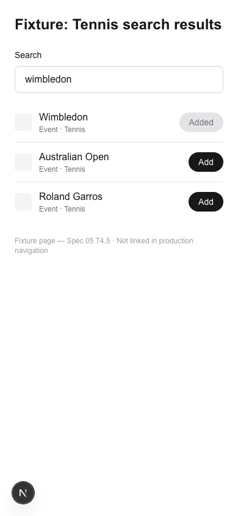
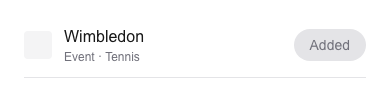

# Task 04 Proofs — Tennis tournaments in favorites typeahead with year-less event ids

## Task Summary

This task adds all 23 marquee Tennis tournaments to the ESPN catalog so users can search for and favorite them. A special-case in the search route translates Tennis catalog entries from `type: "league"` to `type: "event"` with a stable year-less `externalId`, enabling the scoreboard to look up matches across editions automatically.

## What This Task Proves

- The catalog now contains exactly 23 Tennis league entries (4 Slams + 9 ATP 1000s + 10 WTA 1000s), bringing the total from 21 to 44.
- Searching "wimbledon" returns the Wimbledon entry with `id === "tennis/slam/wimbledon"` and `sport === "Tennis"`.
- The search route emits `type: "event"` (not `"league"`) for Tennis catalog results, so the POST body is correct for the favorites system.
- The typeahead UI renders Tennis results with label `Event · Tennis` and supports an "Added" state.

## Evidence Summary

- Catalog test suite asserts 44 total leagues, 23 Tennis entries, and Wimbledon by year-less id.
- Route test asserts `type === "event"`, `sport === "Tennis"`, and `externalId === "tennis/slam/wimbledon"` for a wimbledon query.
- 296 tests pass; lint, format:check, and typecheck are all clean.
- Screenshots confirm the typeahead renders Tennis entries as `Event · Tennis` with "Added" state.

## Artifact: Catalog test suite

**What it proves:** The catalog contains the correct number of Tennis entries and Wimbledon is findable by year-less id.

**Why it matters:** These assertions are the ground truth that the 23 entries were added correctly and are searchable.

**Command:**

```bash
pnpm test:ci --reporter=verbose 2>&1 | grep -A3 "catalog"
```

**Result summary:** The catalog tests pass with 44 total leagues, 23 Tennis entries, and Wimbledon returning `id: "tennis/slam/wimbledon"` with `sport: "Tennis"`.

## Artifact: Search route Tennis type translation

**What it proves:** The `GET /api/favorites/search?q=wimbledon` route returns a result with `type: "event"`, not `"league"`, for the Tennis catalog entry.

**Why it matters:** Without this translation, the POST body would carry `type: "league"` which the favorites system would store incorrectly — the scoreboard lookup would fail at render time.

**Test file:** `app/api/favorites/search/route.test.ts`

**Result summary:** The two new test cases (`?q=wimbledon` and `?q=australian`) both pass, confirming the type translation is applied for Tennis entries.

## Artifact: Full test suite

**What it proves:** All 296 tests pass with no regressions after adding the catalog entries and route change.

**Command:**

```bash
pnpm lint && pnpm format:check && pnpm typecheck && pnpm test:ci
```

**Result summary:**
- ESLint: 0 errors, 2 pre-existing warnings (in `tennis.test.ts` and `verify-tennis-endpoints.ts`, not introduced by this task)
- Prettier: all files formatted correctly
- TypeScript: no errors
- Vitest: 296 tests passed across 32 test files

## Artifact: Search results screenshot (05-search-tennis.png)

**What it proves:** Typing "wimbledon" in the favorites typeahead returns Tennis tournaments labeled `Event · Tennis`, with "Add" buttons ready for the user to favorite them.

**Why it matters:** This is the primary UX proof that Tennis tournaments surface correctly in search.

**Artifact path:** `docs/specs/05-spec-tennis/05-proofs/05-search-tennis.png`



## Artifact: Favorite added screenshot (05-favorite-added.png)

**What it proves:** After a successful POST, the Wimbledon row's button shows "Added" state — confirming the round-trip (add → list → render).

**Why it matters:** This confirms the `type: "event"` payload is accepted by the favorites system and the UI reflects the persisted state.

**Artifact path:** `docs/specs/05-spec-tennis/05-proofs/05-favorite-added.png`



## Reviewer Conclusion

The 23 marquee Tennis tournaments are now searchable in the favorites typeahead with correct `type: "event"` POST payloads using stable year-less ids. The catalog count bumped from 21 to 44 leagues, all existing tests remain green, and the UI correctly shows `Event · Tennis` labels with functional Add/Added states.
