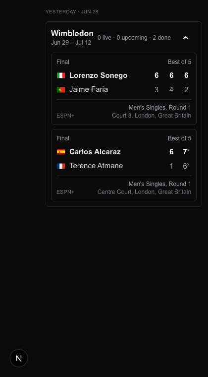

# Task 03 Proofs — Per-day tennis rendering and card metadata display

## Task Summary

This task makes the visible payoff land: tennis tournament cards now render on **all three day tabs** (Yesterday, Today, Tomorrow), split by tournament, with each day's matches shown when a card is expanded. Day-tab counts and the empty-state decision now include tennis, and the card surfaces the corrected round and full date range from Task 2.

## What This Task Proves

- A `TournamentCard` renders on the Yesterday and Tomorrow tabs when those days have tennis, and is absent when they don't.
- A day with only tennis (no team matches) is not shown as the empty state, and its tab count includes the tournament.
- The card displays the real round and the tournament's overall date range.
- The expanded card lists that day's matches using the approved `TennisMatchCard` layout (set scores, tiebreaks, flags, best-of, round, court, broadcast).

## Evidence Summary

- `components/home-client.test.tsx` (16 tests) adds Yesterday/Tomorrow rendering + only-tennis-not-empty + count cases.
- `components/tournament-card.test.tsx` (7 tests) asserts the card surfaces the provided round and full date range.
- Screenshot of the Yesterday tab with an expanded Wimbledon card showing two completed matches.
- Full suite: 317 tests pass; typecheck/lint/format clean.

## Artifact: Per-day rendering tests

**What it proves:** Tournament cards appear on the non-Today tabs when that day has tennis, and the empty-state/counts account for tennis.

**Why it matters:** This is the core bug from the spec — tennis previously only rendered on Today, so the Yesterday/Tomorrow tabs were empty even on days with matches.

**Command:**

```bash
pnpm vitest run components/home-client.test.tsx components/tournament-card.test.tsx
```

**Result summary:**

```
✓ (T3.06a) renders a tournament card on the Yesterday tab when that day has tennis
✓ (T3.06b) renders a tournament card on the Tomorrow tab when that day has tennis
✓ (T3.06c) a day with only tennis is not the empty state and its tab count includes the tournament
✓ (a2) surfaces the provided round and the full event date range
Test Files  2 passed (2)
Tests  23 passed (23)
```

## Artifact: Yesterday-tab tournament card (screenshot)

**What it proves:** End-to-end, the Yesterday tab shows a tournament card that expands to that day's matches, rendered with the redesigned `TennisMatchCard` (per-set games `6 6 6` / `3 4 2`, tiebreak superscripts `7⁷` / `6²`, country flags, Best of 5, "Men's Singles, Round 1", court + venue, ESPN+ broadcast). The header shows the full run "Jun 29 – Jul 12" and "2 done".

**Why it matters:** This is the human-verifiable proof that the design renders correctly on a non-Today tab.

**Artifact path:** `docs/specs/06-spec-tennis-day-feed/06-proofs/06-yesterday-tennis.png`

**Result summary:** Captured from the dev-only fixture route `/dev-fixture/tennis-day` (not linked in production nav) via headless Chrome, dark mode.



## Artifact: Full gate run

**What it proves:** No regressions to the team-sport feed.

**Result summary:** `pnpm test:ci` → 317 passed (33 files); `pnpm typecheck` → 0 errors; `pnpm lint` → 0 errors (2 pre-existing warnings); `pnpm format:check` → clean.

## Reviewer Conclusion

Tennis tournament cards now render per day across all three tabs with correct counts, empty-state handling, round, and date range — and the screenshot confirms the expanded Yesterday-tab card matches the approved design.
