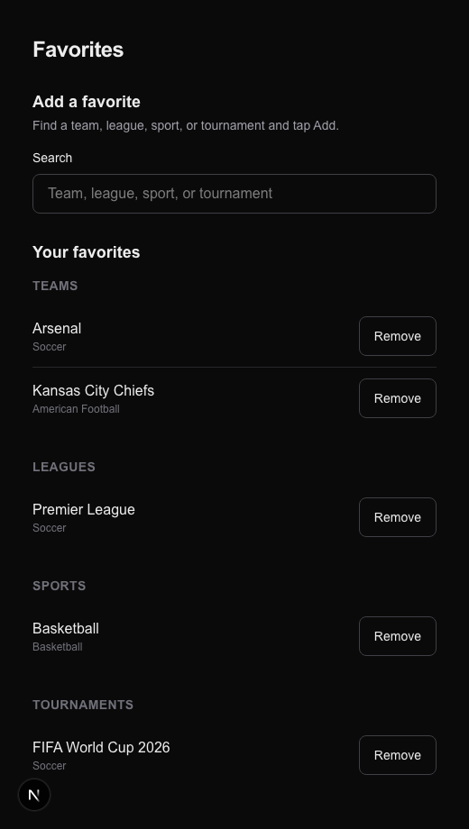

# Task 01 Proofs — Unified Favorites page

## Task Summary

This task merges the two confusingly-named favorites screens — `/favorites` (search/add) and `/my-favorites` (saved list) — into a single `/favorites` page: an "Add a favorite" search section on top, the user's saved favorites (grouped by Teams/Leagues/Sports/Tournaments, each removable) below. `/my-favorites` now permanently redirects to `/favorites` so existing links don't break. No favorites add/remove/validate/query logic or DB schema changed.

## What This Task Proves

- `/favorites` renders both the search/add section and the grouped saved-favorites list.
- The saved-list rendering was extracted into a reusable, independently-tested `FavoritesList` component (grouping, hidden empty types, remove buttons, empty state).
- The unified page still passes `initialFavorites` to `FavoritesSearch`, preserving its "Added" state (regression guard).
- `/my-favorites` redirects to `/favorites`.

## Evidence Summary

- `app/(app)/favorites/page.test.tsx` (5 tests) asserts both sections render, the saved list receives the rows, and `initialFavorites` is still passed.
- `components/favorites-list.test.tsx` (3 tests) covers grouping, hidden empty types, and the empty state.
- `app/(app)/my-favorites/page.test.tsx` asserts the redirect to `/favorites`.
- Screenshot of the unified page (dev-fixture render).
- Full suite: 319 tests pass; typecheck/lint/format clean.

## Artifact: Unified-page + redirect + list tests

**What it proves:** The merge works end-to-end at the page level and the redirect is in place.

**Why it matters:** This is the core of the spec — one place to add and manage favorites, with no broken `/my-favorites` links.

**Command:**

```bash
pnpm vitest run "app/(app)/favorites/page.test.tsx" "app/(app)/my-favorites/page.test.tsx" components/favorites-list.test.tsx
```

**Result summary:** 9 tests pass.

```
✓ app/(app)/favorites/page.test.tsx (5 tests)
  ✓ renders both the add section and the saved-favorites list
  ✓ preserves FavoritesSearch's 'Added' state by passing initialFavorites
  ✓ passes an empty saved list to FavoritesList when the user has none
✓ app/(app)/my-favorites/page.test.tsx (1 test)
  ✓ redirects to the unified /favorites page
✓ components/favorites-list.test.tsx (3 tests)
```

## Artifact: Unified Favorites screenshot

**What it proves:** The page shows the add section above the grouped saved list, as designed.

**Why it matters:** Human-verifiable confirmation of the merged layout.

**Note:** Captured from the dev-only fixture route `/dev-fixture/nav` (not linked in production nav) via headless Chrome; authenticated-route behavior is covered by the route tests above.

**Artifact path:** `docs/specs/07-spec-navigation-restructure/07-proofs/07-favorites-unified.png`



## Reviewer Conclusion

The two favorites screens are merged into one `/favorites` page, the saved-list rendering is a tested standalone component, the "Added" search state is preserved, and `/my-favorites` redirects — all with the full suite green and no favorites-logic changes.
