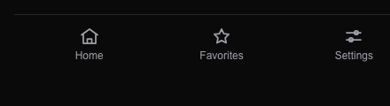

# Task 03 Proofs — Redesigned bottom navigation

## Task Summary

This task replaces the three text-only nav items with three icon+label destinations — **Home · Favorites · Settings** — using inline SVG icons (no new dependency). The "My Favorites" item is removed (its page now redirects to `/favorites`), and the nav points at the new `/settings` route. Active-state styling, `aria-current`, prefix-based active matching, ≥44px touch targets, and safe-area insets are all preserved.

## What This Task Proves

- The bottom nav renders exactly three destinations in order — Home (`/home`), Favorites (`/favorites`), Settings (`/settings`) — each with an inline `svg` icon above its text label.
- "My Favorites" is gone from the nav.
- The active route gets `aria-current="page"` + the distinct active styling, and a nested path (e.g. `/favorites/abc`) keeps its tab active.
- Each item keeps the `min-h-11`/`min-w-11` touch target.

## Evidence Summary

- `components/bottom-nav.test.tsx` (7 tests) covers the three destinations, no "My Favorites", icon+label per item, active + `aria-current`, nested-prefix matching, and touch targets.
- Screenshot of the redesigned nav (house / star / sliders icons).
- Full suite: 325 tests pass; typecheck/lint/format clean.

## Artifact: Bottom-nav tests

**What it proves:** The nav structure, icons, active-state behavior, and touch targets are all correct.

**Why it matters:** This is the core navigation contract every signed-in screen depends on.

**Command:**

```bash
pnpm vitest run components/bottom-nav.test.tsx
```

**Result summary:** 7 tests pass.

```
✓ renders the three destinations in order: Home, Favorites, Settings
✓ no longer renders a 'My Favorites' destination
✓ renders an inline SVG icon + a text label for every item
✓ each nav item meets the 44×44 touch-target rule via min-h-11/min-w-11
✓ marks the active route with aria-current='page' when pathname matches exactly
✓ marks the active route when pathname is a sub-path (e.g. /favorites/123)
✓ active item gets a visually distinct class (bg-foreground text-background)
```

## Artifact: Bottom-nav screenshot

**What it proves:** The three destinations render as icon+label (house = Home, star = Favorites, sliders = Settings).

**Why it matters:** Human-verifiable confirmation of the visual redesign.

**Note:** Captured from the dev-only fixture route `/dev-fixture/nav?view=nav` (not linked in production nav) via headless Chrome. The nav's normal `position: fixed` is overridden to static flow in the fixture purely so the bar captures in a focused screenshot; active-state behavior is verified by the tests above.

**Artifact path:** `docs/specs/07-spec-navigation-restructure/07-proofs/07-bottom-nav.png`



## Reviewer Conclusion

The bottom nav is now a clean three-destination icon+label bar (Home · Favorites · Settings) with "My Favorites" removed, active-state and touch-target behavior preserved, and full test coverage — the suite stays green.
