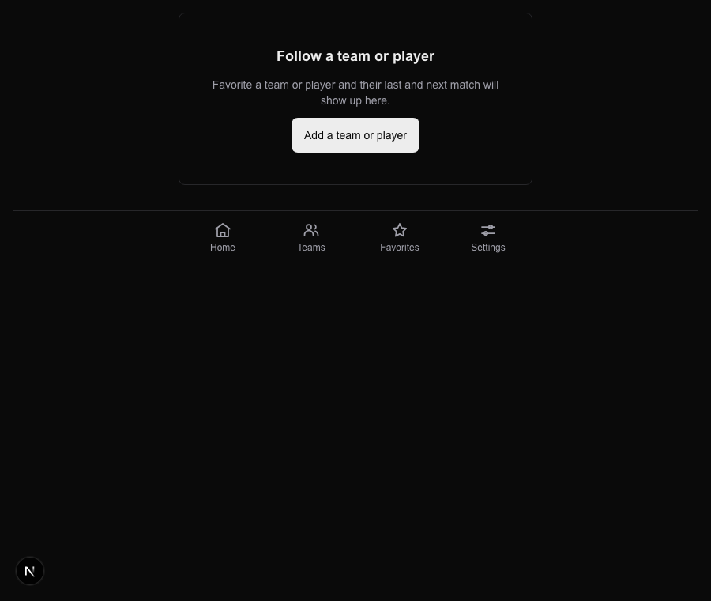

# Task 01 Proofs — Teams destination shell & four-item bottom nav

## Task Summary

This task proves the app now has a fourth navigation destination — **Teams** — wired into the bottom nav between Home and Favorites, and that visiting `/teams` renders a meaningful empty state (with a link to `/favorites`) when the signed-in user follows no team or player favorites. The data-driven card list is intentionally deferred to Task 2.0; this task delivers the reachable shell only.

## What This Task Proves

- The bottom nav renders exactly four destinations in order — Home · Teams · Favorites · Settings — each with an inline SVG icon, correct `href`, `min-h-11`/`min-w-11` touch targets, and `aria-current="page"` only on the active item.
- The `/teams` server route gates auth (redirects to `/signin` with no session), and branches between an empty state and a loading placeholder based on whether the user has any `team`/`player` favorites.
- The empty state links users to `/favorites` to add a team or player.

## Evidence Summary

- `components/bottom-nav.test.tsx` asserts four links in the exact order with correct `href`s and `aria-current` behavior — all pass.
- `app/(app)/teams/page.test.tsx` covers the redirect, the empty-state (with `/favorites` link), and the loading-placeholder branch — all pass.
- The full suite (`pnpm test:ci`) passes at **369 tests**, and `lint`/`format:check`/`typecheck` are clean.
- A screenshot shows the Teams empty state above the live four-item bottom nav.

## Artifact: Nav + Teams-page unit tests

**What it proves:** The nav update and the Teams shell behave as specified across every branch.

**Why it matters:** These are the regression-proof for the navigation contract (item count/order/active state) and the server shell's auth + empty-state logic.

**Command:**

```bash
pnpm vitest run components/bottom-nav.test.tsx "app/(app)/teams/page.test.tsx"
```

**Result summary:** Both files pass — 7 nav tests and 3 Teams-page tests (10 total).

```
 ✓ app/(app)/teams/page.test.tsx (3 tests) 45ms
 ✓ components/bottom-nav.test.tsx (7 tests) 76ms

 Test Files  2 passed (2)
      Tests  10 passed (10)
```

## Artifact: Full quality gates

**What it proves:** The change integrates cleanly with the whole codebase — no type, lint, format, or test regressions.

**Why it matters:** CI runs lint → format:check → typecheck → test:ci; this mirrors that gate order locally.

**Command:**

```bash
pnpm format:check && pnpm lint && pnpm typecheck && pnpm test:ci
```

**Result summary:** Format clean; lint reports 0 errors (2 pre-existing warnings in untouched files `lib/espn/tennis.test.ts` and `scripts/verify-tennis-endpoints.ts`); typecheck clean; all tests pass.

```
Checking formatting...
All matched files use Prettier code style!
...
✖ 2 problems (0 errors, 2 warnings)
...
 Test Files  38 passed (38)
      Tests  369 passed (369)
```

## Artifact: Teams empty-state screenshot

**What it proves:** The Teams empty state and the four-item bottom nav (Home · Teams · Favorites · Settings) render live, with the new outline "people" Teams icon visible.

**Why it matters:** This is the user-facing confirmation that the navigation change and shell are actually live, not just asserted in tests. Captured via the dev-only fixture route `/dev-fixture/nav?view=teams` (not linked in production nav) using headless Chrome, so no real session is required; authenticated-route behavior is covered by the page tests above.

**Artifact path:** `docs/specs/09-spec-home-feed-split/09-proofs/09-teams-empty.png`

**Result summary:** The screenshot shows the "Follow a team or player" empty state with an "Add a team or player" button, above the four-item bottom nav.



## Reviewer Conclusion

The Teams tab is present, correctly ordered, and reachable; the `/teams` route gates auth and shows a helpful empty state linking to Favorites. Tests and quality gates confirm the behavior with no regressions. The data-driven entity cards are correctly left for Task 2.0.
