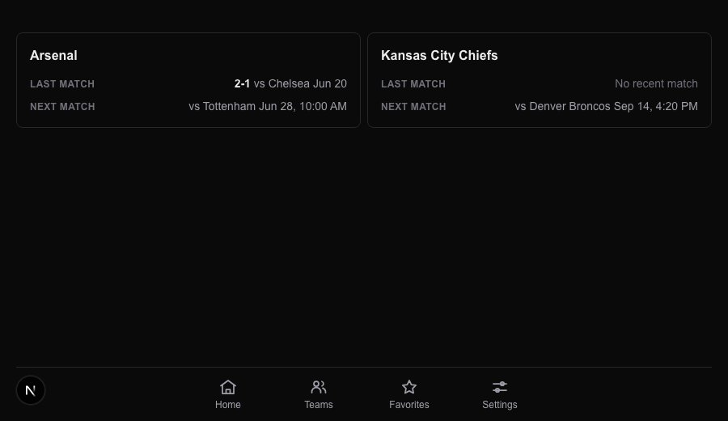

# Task 02 Proofs — Team entity cards, `/api/teams` endpoint & home-feed exclusion

## Task Summary

This task proves the Teams destination is now data-driven end-to-end: a new auth-gated `GET /api/teams` endpoint returns one entity per followed team (with its most-recent and next match), a presentational `EntityCard` renders each entity's Last/Next match rows, a `TeamsClient` fetches and polls that endpoint, and — critically — team favorites are now **excluded** from the Home feed so a team only ever appears on the Teams tab.

## What This Task Proves

- `GET /api/teams` returns `{ entities: [{ favoriteId, displayName, type, sport, lastMatch, nextMatch }], source }`, integrates the ESPN team schedule, and degrades gracefully (null matches + `source.ok:false`) when the catalog lookup misses or the schedule fetch throws.
- `EntityCard` renders correctly across every data state: full data, both-null ("Match data unavailable"), and next-only ("No recent match").
- `TeamsClient` triggers the initial `/api/teams` load on mount and aborts the in-flight request on unmount.
- The home aggregator no longer expands team favorites into league fan-out, and a teams-only user gets an empty home envelope — team matches live only on the Teams tab.
- `HomeClient` shows a distinct "Teams-only" prompt (linking to `/teams`) when the user follows only teams and has no home-feed matches.

## Evidence Summary

- `app/api/teams/route.test.ts` (4 tests): 401 when unauthenticated; last/next extraction with score + kickoff; catalog-miss and schedule-throw both yield null matches + `source.ok:false`.
- `components/entity-card.test.tsx` (3 tests): full, both-null, and next-only states.
- `components/teams-client.test.tsx` (2 tests): fetches `/api/teams` on mount; aborts on unmount.
- `lib/home/aggregator.test.ts`: team favorites excluded from `planLeagueKeys` (returns `[]`); teams-only user → empty envelope with zero fetcher calls.
- `components/home-client.test.tsx`: the Teams-only prompt renders (with `/teams` link) and suppresses the generic empty states.
- Full suite: **381 tests pass**; lint/format/typecheck clean.
- Screenshot: the Teams page with two populated entity cards.

## Artifact: `/api/teams` route + component + aggregator tests

**What it proves:** The data contract, card rendering, client fetch/abort, and home-feed exclusion all behave as specified.

**Why it matters:** These are the regression guards for the endpoint's shape and graceful-failure paths, the card's every data state, and — most importantly — the guarantee that team favorites never leak back onto the home feed.

**Command:**

```bash
pnpm vitest run app/api/teams/route.test.ts components/entity-card.test.tsx \
  components/teams-client.test.tsx lib/home/aggregator.test.ts \
  components/home-client.test.tsx
```

**Result summary:** All target files pass — route (4), entity-card (3), teams-client (2), aggregator (22, incl. the new exclusion tests), home-client (18, incl. the new Teams-only prompt test).

```
 ✓ lib/home/aggregator.test.ts (22 tests)
 ✓ components/teams-client.test.tsx (2 tests)
 ✓ components/entity-card.test.tsx (3 tests)
 ✓ app/(app)/teams/page.test.tsx (3 tests)
 ✓ components/home-client.test.tsx (18 tests)
```

## Artifact: Full quality gates

**What it proves:** The change integrates cleanly across the codebase.

**Why it matters:** Mirrors CI's lint → format:check → typecheck → test:ci gate order.

**Command:**

```bash
pnpm format:check && pnpm lint && pnpm typecheck && pnpm test:ci
```

**Result summary:** Format clean; lint 0 errors (2 pre-existing warnings in untouched files); typecheck clean; all tests pass.

```
 Test Files  41 passed (41)
      Tests  381 passed (381)
```

## Artifact: Teams page entity cards screenshot

**What it proves:** The Teams page renders one `EntityCard` per followed team, each with a "Last match" row and a "Next match" row (including the "No recent match" fallback on the Chiefs card).

**Why it matters:** This is the user-facing confirmation of the card layout and the last/next contract. Captured via the dev-only fixture `/dev-fixture/nav?view=teams-cards` (not linked in production) using headless Chrome, so no real session is required; the endpoint and data logic are covered by the route tests above.

**Artifact path:** `docs/specs/09-spec-home-feed-split/09-proofs/09-teams-cards.png`

**Result summary:** Two entity cards — Arsenal (Last: 2-1 vs Chelsea Jun 20; Next: vs Tottenham Jun 28) and Kansas City Chiefs (Last: No recent match; Next: vs Denver Broncos Sep 14) — above the four-item bottom nav.



## Reviewer Conclusion

The Teams destination is now fully data-driven: `/api/teams` returns the correct contract and fails gracefully, `EntityCard` covers every data state, `TeamsClient` loads and cancels correctly, and team favorites are provably excluded from the home feed with a helpful pointer to the Teams tab. Tests and quality gates confirm no regressions.
