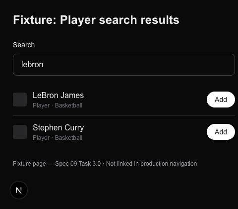

# Task 03 Proofs — Player favorite type (DB migration, TypeScript, search)

## Task Summary

This task proves a user can now follow an athlete: `"player"` is a first-class favorite type end-to-end — added to the `FavoriteType` union, the Postgres `favorite_type` enum (via a committed, applied migration), the saved-favorites list UI, and the search typeahead, which now fans out a live ESPN athlete search and returns `type: "player"` results.

## What This Task Proves

- The `favorite_type` Postgres enum gains `player` via a generated migration that applies cleanly with `pnpm db:migrate`.
- `FavoriteType` / `FAVORITE_TYPES` include `"player"`; the validators accept it and the home-feed matcher correctly treats a player favorite as claiming no home-feed match.
- The Favorites saved-list groups a "Players" section, and search results render a "Player" type label.
- `GET /api/favorites/search` includes `type: "player"` results (correct `externalId`, `displayName`, `sport`) and dedupes an athlete id seen across sports.

## Evidence Summary

- Migration `db/migrations/0004_optimal_matthew_murdock.sql` contains `ALTER TYPE "public"."favorite_type" ADD VALUE IF NOT EXISTS 'player'` and applied without error.
- `app/api/favorites/search/route.test.ts` (24 tests) — a mocked athlete result surfaces as a `type: "player"` result with the right shape; a duplicate id across sports collapses to one.
- Existing "unknown type" negative tests were updated (they had used `"player"` as their invalid example — now valid).
- Full suite: **383 tests pass**; lint/format/typecheck clean.
- Screenshot: the Favorites search with an athlete query and Player result rows.

## Artifact: Applied enum migration

**What it proves:** The schema change is real, committed, and idempotent.

**Why it matters:** Player favorites can't be persisted until the DB enum accepts the value; the `IF NOT EXISTS` form keeps re-runs safe.

**Command:**

```bash
pnpm db:generate   # produced 0004_optimal_matthew_murdock.sql
pnpm db:migrate    # applied to the dev DB
```

**Artifact path:** `db/migrations/0004_optimal_matthew_murdock.sql`

**Result summary:** `pnpm db:migrate` reported "Migrations applied successfully." (The only other output was benign `NOTICE: ... already exists, skipping` for the drizzle bookkeeping schema.) A pre-existing snapshot-id collision between migrations `0002`/`0003` was repaired so drizzle-kit could chain the new migration — see the Reviewer note.

```sql
ALTER TYPE "public"."favorite_type" ADD VALUE IF NOT EXISTS 'player';
```

## Artifact: Search route returns player results

**What it proves:** The typeahead fans out an athlete search and returns correctly-shaped player results, with cross-sport dedup.

**Why it matters:** This is the mechanism by which a user discovers and saves an athlete favorite.

**Command:**

```bash
pnpm vitest run app/api/favorites/search/route.test.ts
```

**Result summary:** 24 tests pass, including the new player cases (a mocked athlete surfaces as `type: "player"`, `externalId: "1966"`, `sport: "Basketball"`; a duplicate id collapses to one result). The live ESPN call is mocked so the suite stays deterministic and offline.

```
 ✓ app/api/favorites/search/route.test.ts (24 tests)
```

## Artifact: Full quality gates

**Command:**

```bash
pnpm format:check && pnpm lint && pnpm typecheck && pnpm test:ci
```

**Result summary:** Format clean; lint 0 errors (2 pre-existing warnings in untouched files); typecheck clean; all tests pass.

```
 Test Files  41 passed (41)
      Tests  383 passed (383)
```

## Artifact: Player search screenshot

**What it proves:** The Favorites search UI renders athlete results with a "Player" type label and an Add button.

**Why it matters:** End-to-end confirmation of the player-search UX. Captured via the dev-only fixture `/dev-fixture/player-search` (mirroring the real `FavoritesSearch` row markup, not linked in production) so no live session/ESPN call is needed; the live route behavior is covered by the route tests above.

**Artifact path:** `docs/specs/09-spec-home-feed-split/09-proofs/09-player-search.png`

**Result summary:** The search field holds "lebron" and two Player rows render — "LeBron James · Player · Basketball" and "Stephen Curry · Player · Basketball" — each with an Add button.



## Reviewer Conclusion

`"player"` is now a fully-wired favorite type: the DB enum accepts it (applied migration), the type system and validators recognize it, the saved list and search label it, and search returns real player results. Tests and gates confirm no regressions.

**Reviewer note (pre-existing migration repair):** `db/migrations/meta/0003_snapshot.json` had been committed with the same `id` as `0002` (a data-only `TRUNCATE` with no schema delta), which broke drizzle-kit's snapshot chain and blocked `db:generate`. I gave `0003` a fresh `id` chained to `0002` (content unchanged, since the schema is identical) so generation could proceed. No applied migration SQL was altered.
