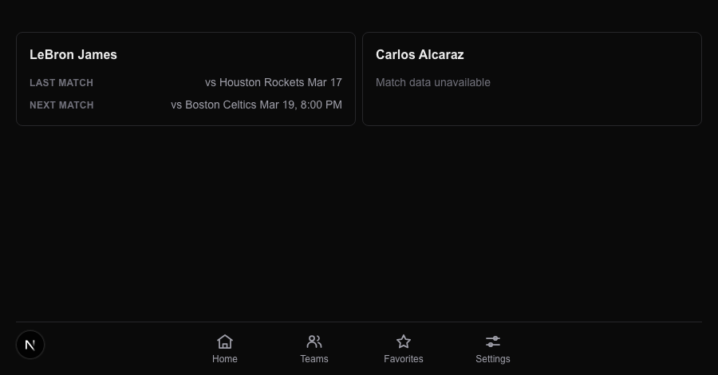

# Task 04 Proofs — Player entity cards on the Teams page

## Task Summary

This task completes the player-favorites flow: a saved athlete now appears on the Teams page as an entity card showing Last/Next match rows when ESPN has data, and a graceful "Match data unavailable" message when it doesn't. The `/api/teams` player branch is wired to a new best-effort `athleteSchedule` built on the ESPN core-API athlete eventlog (verified in the 4.1 spike).

## What This Task Proves

- The ESPN site-v2 athlete endpoints don't exist (404); the core-API athlete `eventlog` does, and `athleteSchedule` resolves it into last/next `EntityMatch` rows — falling back to `{ null, null }` on any error, never throwing.
- `/api/teams` returns real `lastMatch`/`nextMatch` for a player when `athleteSchedule` resolves, and still returns the entity (null matches, `source.ok:false`) when it throws.
- `EntityCard` renders a player entity's match rows when populated and "Match data unavailable" when both are null.

## Evidence Summary

- 4.1 spike: live probes show site-v2 `athletes/{id}/eventlog` and `athletes?search=` return `{"code":404}`; the core API `.../athletes/{id}/eventlog` returns `events.items[]` with `{ event: {$ref}, teamId, played }`. Findings are documented in the `athleteSchedule` header comment.
- A live end-to-end run of the `athleteSchedule` logic against real ESPN resolved LeBron James's last match (opponent "Houston Rockets", real date) and gracefully returned `null` for the next match (no upcoming games in-window).
- `app/api/teams/route.test.ts` (6 tests): player-with-data returns last/next rows using the sport's primary league key; player whose `athleteSchedule` throws returns null matches + `source.ok:false`.
- `components/entity-card.test.tsx` (5 tests): player-with-data renders match rows; player-with-no-data renders "Match data unavailable".
- Full suite: **387 tests pass**; lint/format/typecheck clean.
- Screenshot: a Teams page with a data-bearing player card and a graceful-fallback player card.

## Artifact: 4.1 spike — ESPN athlete endpoint investigation

**What it proves:** The documented endpoint doesn't exist; the working source and its shape are identified.

**Why it matters:** It justifies the core-API `$ref` approach and the best-effort/graceful-fallback design.

**Commands & results:**

```
GET site.api.espn.com/.../basketball/nba/athletes/1966/eventlog   → {"code":404}
GET site.api.espn.com/.../basketball/nba/athletes?search=lebron   → {"code":404}
GET sports.core.api.espn.com/v2/sports/basketball/leagues/nba/athletes/1966/eventlog
    → { events: { items: [ { event: {$ref}, teamId, played }, ... ] } }
GET <event.$ref>  → { date: "2025-11-19T03:30Z", name: "Utah Jazz at Los Angeles Lakers", competitions:[{competitors:[{id,homeAway}]}] }
```

**Result summary:** Scores sit behind further `$ref` hops (competitor → score) and individual sports (Tennis) use a different eventlog shape, so `athleteSchedule` returns best-effort date+opponent and falls back gracefully everywhere else. This is recorded in a comment at the top of `athleteSchedule` in `lib/espn/client.ts`.

## Artifact: Live `athleteSchedule` behavior

**What it proves:** The implementation actually returns match data from real ESPN.

**Why it matters:** Confirms the core-API path is not just theoretical — it resolves a real athlete's most-recent match.

**Result summary:** Running the `athleteSchedule` logic for `basketball/nba` / athlete `1966` returned `lastMatch { opponentName: "Houston Rockets", date: "2026-03-17", kickoffUtc }` and `nextMatch: null` (all 50 eventlog items were already played) — exactly the graceful degradation the card handles.

```json
{ "lastMatch": { "opponentName": "Houston Rockets", "date": "2026-03-17" }, "nextMatch": null }
```

## Artifact: Route + card unit tests

**Command:**

```bash
pnpm vitest run app/api/teams/route.test.ts components/entity-card.test.tsx
```

**Result summary:** 6 route tests (incl. player-with-data and player-throws) and 5 entity-card tests (incl. the two player cases) pass.

```
 ✓ app/api/teams/route.test.ts (6 tests)
 ✓ components/entity-card.test.tsx (5 tests)
```

## Artifact: Full quality gates

**Command:**

```bash
pnpm format:check && pnpm lint && pnpm typecheck && pnpm test:ci
```

**Result summary:** Format clean; lint 0 errors (2 pre-existing warnings in untouched files); typecheck clean; all tests pass.

```
 Test Files  41 passed (41)
      Tests  387 passed (387)
```

## Artifact: Player card screenshot

**What it proves:** A player favorite renders on the Teams page — both the data-bearing and the graceful-fallback states.

**Why it matters:** End-to-end confirmation of the full player-favorites flow the spec's 4.0 demoable calls for.

**Artifact path:** `docs/specs/09-spec-home-feed-split/09-proofs/09-player-card.png`

**Result summary:** "LeBron James" shows Last (vs Houston Rockets) and Next (vs Boston Celtics) rows; "Carlos Alcaraz" (a player ESPN has no usable schedule for) shows "Match data unavailable" — above the four-item bottom nav. Captured via the dev-only fixture `/dev-fixture/nav?view=player-cards`; the endpoint/data logic is covered by the route tests and the live run above.



## Reviewer Conclusion

Player favorites now flow end-to-end onto the Teams page. `athleteSchedule` extracts real last/next matches from ESPN's core athlete eventlog where available and degrades gracefully to "Match data unavailable" everywhere else — proven by unit tests, a live ESPN run, and the screenshot. No regressions.
