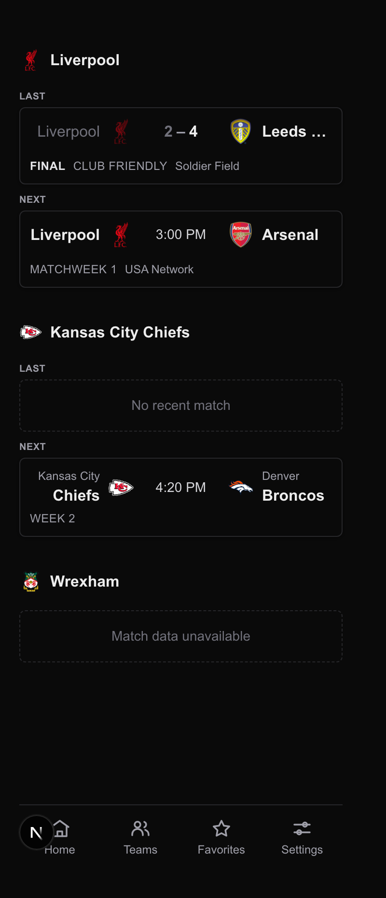
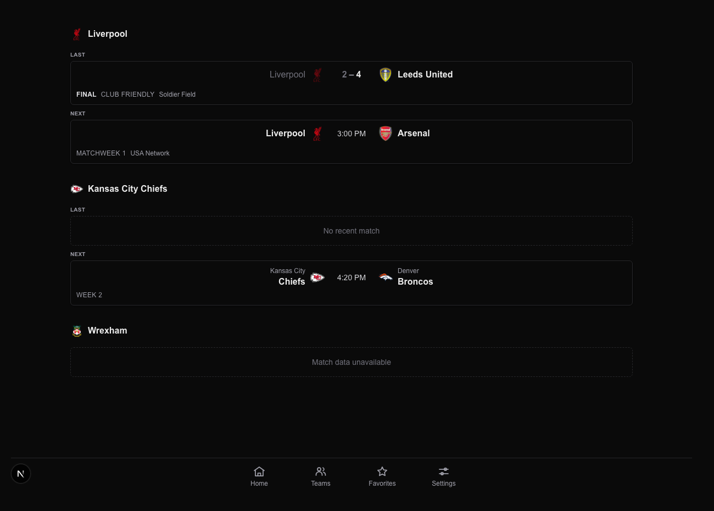

# Task 04 Proofs — Teams list score-card redesign

## Task Summary

The Teams list showed each followed entity as two dense text rows
(`LAST  vs Chelsea  2-1`). This task finishes the switch to Home-style score
cards: the competition-name footer fallback, a single-column layout at every
width, and the visual evidence that the whole spec works end to end.

The card component swap itself landed in Task 3.0 — changing `TeamEntity` to
`Match` broke `EntityCard`'s compile, so it had to move there. See
`13-task-03-proofs.md`.

## What This Task Proves

- A match on the Teams list is rendered by the same component as on Home, with
  crests, both sides' names, and the score.
- Friendlies are visibly labelled, so a preseason friendly is distinguishable
  from a league fixture.
- The layout is one column at 375px **and** at 1280px — the multi-column grid is
  gone, not merely stacked on mobile.
- All three entity states survive the redesign: both sides populated, one side
  empty, both empty.
- Liverpool — the reported bug — now shows a real result and a real fixture.

## Evidence Summary

- Two screenshots, mobile and desktop, from a live dev server.
- 507/507 tests pass; 4 new cases across `match-card` and `teams-client`.
- No console errors on the rendered page.
- Typecheck and format clean.

## Artifact: Teams list at 375px

**What it proves:** The redesign end to end — score cards, crests, competition
labels, slot labels, both empty states, single column.

**Why it matters:** This is the screen the request was about. Every element of
the complaint is visible in one frame: Liverpool has matches again, the most
recent one is a friendly, and it reads as a card rather than a scoreline.

**Artifact path:** `13-proofs/images/teams-list-375.png`

**Result summary:** Liverpool's last match is the 2–4 friendly against Leeds at
Soldier Field, labelled `FINAL · CLUB FRIENDLY`, with the losing side dimmed.
Next is Arsenal at 3:00 PM, labelled `MATCHWEEK 1 · USA Network`. The Chiefs show
the per-side "No recent match" state; Wrexham shows the both-null
"Match data unavailable" state. One column, no horizontal overflow.



## Artifact: Teams list at 1280px

**What it proves:** The layout is single-column at desktop width too.

**Why it matters:** This closes REQUIRED failure #3 from the planning audit. A
375px screenshot alone would pass equally for a `sm:grid-cols-2` grid that
merely stacks on mobile — the audit's exact objection.

**Artifact path:** `13-proofs/images/teams-list-1280.png`

**Result summary:** Three entities stacked vertically at 1280px. No second
column appears.



## Artifact: Layout guard test

**What it proves:** The responsive grid classes are absent from the container,
not overridden.

**Why it matters:** Screenshots prove a moment; the test prevents someone
reinstating `sm:grid-cols-2` later without noticing.

**Command:**

```bash
pnpm test:ci components/teams-client.test.tsx
```

**Result summary:** Passes, asserting no `sm:`/`md:`/`lg:grid-cols-*` class
survives on `[data-testid="entity-list"]`.

```text
✓ fetches /api/teams on mount
✓ aborts the in-flight request on unmount
✓ lays entities out in a single column at every breakpoint
```

## Artifact: Competition label

**What it proves:** `MatchCard` shows `leagueName` when a match has no `round`,
and still prefers `round` when ESPN supplies it.

**Why it matters:** Friendlies and cup ties usually have no `round`. Before this
change those cards carried no competition text at all, which is exactly what
would make a friendly indistinguishable from a league game once friendlies
started appearing.

**Command:**

```bash
pnpm test:ci components/match-card.test.tsx
```

**Result summary:** 12 tests pass, including three new cases. Visible in both
screenshots as `CLUB FRIENDLY` on the friendly and `MATCHWEEK 1` on the league
fixture — the round winning where it exists.

```text
✓ falls back to leagueName when the match has no round
✓ prefers round over leagueName when ESPN provides both
✓ renders a footer for an upcoming match that only has a competition
```

## Artifact: Console clean

**What it proves:** No runtime errors on the redesigned screen.

**Command:** `read_console_messages(onlyErrors: true)` against the rendered page.

**Result summary:** No console logs. Crest images all resolved
(`naturalWidth: 500`, `complete: true` for all 9).

## Artifact: Repository quality gates

**Command:**

```bash
pnpm typecheck && pnpm format:check && pnpm test:ci
```

```text
$ tsc --noEmit
(no output)

$ prettier --check .
All matched files use Prettier code style!

 Test Files  48 passed (48)
      Tests  507 passed (507)
```

`pnpm lint` remains at the 3 pre-existing problems documented in
`13-task-01-proofs.md`.

## Design change made during implementation: no outer card box

The first render truncated team names badly — `Liver…`, `Leed…`, `Bron…` at
375px. Cause: `EntityCard` wrapped the match cards in its own bordered,
padded box, costing ~24px of horizontal room versus Home, which the card's
fixed 80px score column and 28px crests then squeezed out of the name blocks.

```text
375 viewport
 − 40  page px-5
 − 24  EntityCard p-3      ← the nesting
 − 20  MatchCard p-2.5
 − 80  score column (w-20)
 − 16  gaps
 = 195 for two team blocks → ~61px per name after the crest
```

Removing `EntityCard`'s own border and padding recovers those 24px (~73px per
name, matching Home) and drops a box-in-a-box that read as clutter anyway. The
match cards now provide the visual boundary and the list's `gap-6` separates
entities. `Leeds United` still truncates, because it does not end with its short
name `Leeds` and so renders unsplit — identical to Home's behaviour, not a
regression introduced here.

## Notes on how these screenshots were captured

Two things a reviewer reproducing this should know:

1. **Source is the dev-fixture route**, `dev-fixture/nav?view=teams-cards`, not
   the live `/teams` screen. `/teams` is auth-gated and I will not authenticate
   on the user's behalf. The fixture renders the real `EntityCard`,
   `MatchCard`, and `TeamsClient` container classes, and its data is Liverpool's
   actual 2026-08-05 state recorded from ESPN — real ids, real crest URLs, the
   real 2–4 friendly at Soldier Field. The fixture's container was updated in
   this task to mirror `TeamsClient` exactly; both use `max-w-5xl px-5`.
   What it does **not** prove is the live API wiring — that is covered by the
   route tests in Tasks 2.0 and 3.0.
2. **Headless Chrome would not honour a 375px window** on this machine; it laid
   out wider and cropped, which initially looked like horizontal overflow. It is
   not: measured in a real browser, `scrollWidth === clientWidth === 375` and the
   cards are 335px. The captures were taken through a fixed-width iframe wrapper
   to force the layout viewport, and match the live browser render exactly. The
   wrapper was deleted afterwards.

## Reviewer Conclusion

The Teams list now renders matches the way Home does, in one column at every
width, with friendlies labelled as friendlies. The Liverpool card shows the
result and fixture that the original report said were missing. The audit's
breakpoint objection is answered with a desktop screenshot and a class-level
test rather than a single mobile frame.
